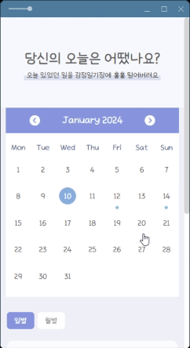
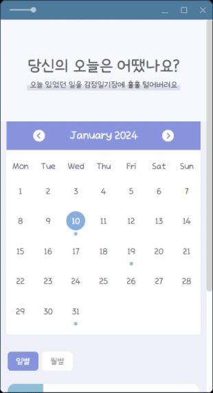
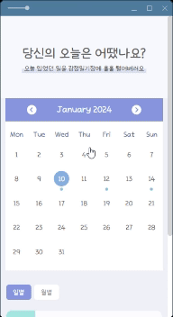
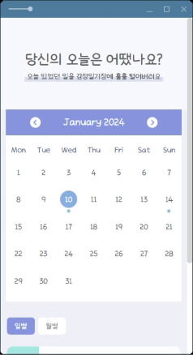
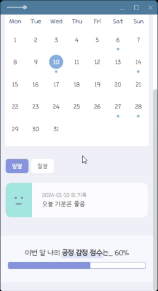
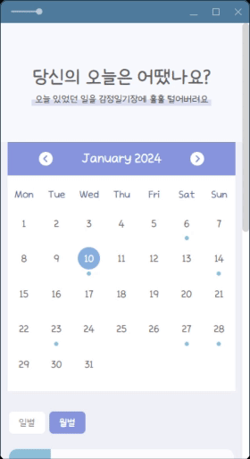

 

# 하루 하나, 감정다이어리
<a href="https://wonbin-haru-diary-project.web.app/" title="새 창으로 열기" target="_blank">https://wonbin-haru-diary-project.web.app/</a>
<blockquote>달력을 이용하여 하루에 한개 씩 나의 감정 일기장을 작성할 수 있는 리액트 앱입니다</blockquote>
 

## 프로그래밍 언어 & 프레임워크

  
  
  
  

- react-calendar: https://github.com/wojtekmaj/react-calendar 
- moment: https://www.npmjs.com/package/react-moment 
- react-router-dom: https://reactrouter.com/en/main
 

### 오늘 하루의 기분과 일기를 작성할 수 있어요

<blockquote>오늘 작성한 일기가 없을 경우 일기 쓰기 버튼이 활성화돼요. 
작성한 일기가 있다면 해당 일기 아이템이 노출돼요.</blockquote>
 

### 작성된 일기가 있는 날에는 달력에 표시가 돼요

 

### 탭을 통해 일별과 월별로 작성된 일기 리스트를 볼 수 있어요

 

### 기록했던 일기를 수정/삭제 할 수 있어요

 

### 원하는 일자에 일기를 작성할 수 있어요

 

### 한 달 간의 나의 감정 점수를 확인 할 수 있어요

<blockquote>감정 점수는 1~3점을 긍정으로 보고, 해당 월 데이터를 기반으로 평균을 내요.</blockquote>
 

### 달력을 넘길때마다 해당 하는 달의 일기와 감정 점수를 볼 수 있어요

<blockquote>달을 넘길 때 자동으로 매 달의 1일로 지정이 되고, 현재 달일 경우에는 자동으로 오늘로 지정이 돼요</blockquote>
